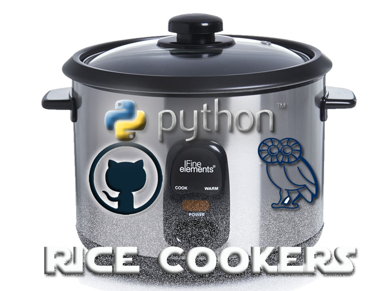

# Unit 1 Homework: Kickstart My Chart

## Background

Over $2 billion has been raised using the massively successful crowdfunding service, Kickstarter, but not every project has found success. Of the more than 300,000 projects launched on Kickstarter, only a third have made it through the funding process with a positive outcome.

Getting funded on Kickstarter requires meeting or exceeding the project's initial goal, so many organizations spend months looking through past projects in an attempt to discover some trick for finding success. For this week's homework, you will organize and analyze a database of 4,000 past projects in order to uncover any hidden trends.

## Summary

I used the Excel table provided, modified and analyzed the data of 4,000 past Kickstarter projects to complete the homework assignment. It involved data manipulation, conditional formatting, pivot tables, tacked column pivot charts & an attempt at Statistical Analysis.

## Submission

https://github.com/BrianLabelle/hw1

- - -

© 2019 Rice Cookers | Brian Labelle | Sous-Coding Chef
